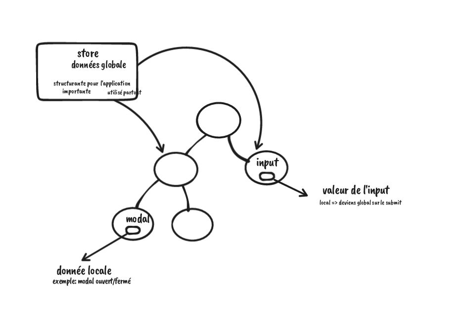
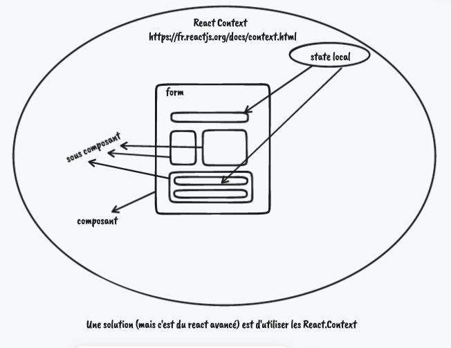

# /!\ WIP /!\

## Redux controlled component



It is not because we use Redux that we have to stock absolutely all data in the store. We can choose (wisely) regarding if the data is **local** or **global**.

Here, I chose to use the vanilla React `useState` and `useEffect` becase the data is local so it do not have to be in the Redux store.
But regarding the project's governance, it is absolutely possible to handle it with Redux and stock it in the store.

The advantage is that if we have some big form with sub-components, using the Redux store and the global state for controlled components like inputs and so on allow us to access data from anywhere without bothering to transport the data where they have to be used.

**BUT** it is more complexe, and less fast to load, and the more the app grows up, the more the app will be slow down.

An other way to handle some forms could be **React context**, so note for later : take a look at the [React context doc](https://fr.reactjs.org/docs/context.html).



## UseSelector - Comparison function

```js
function useSelector(cbSelection, compareFunction = undefined){
    const [oldStateSlice, setOldStateSlice] = useState(null);

    storeFromProvider.subscribe(() => {
        const state = storeFromProvider.getState(); // get the store given to the Provider

        const stateSlice = cbSelection(state);

        let doReRender = false;
        if(typeof compareFunction === "function"){
            doReRender = compareFunction(oldStateSlice, stateSlice);
        }else{
            doReRender = oldStateSlice !== stateSlice
        }

        // simple comparison between the new value and the old value
        if(){
            // 
            // si c'est différent il met à jour l'ancienne valeur avec la nouvelle valeur
            //  du coup, faire un setState, déclenche un re-render
            setOldStateSlice(stateSlice);
        }
    });

    return oldStateSlice;
}
```
