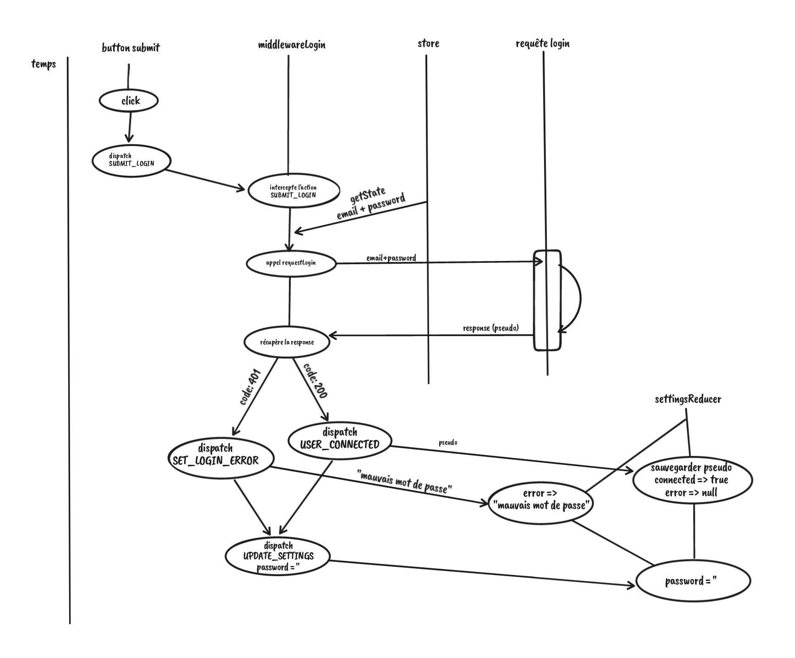

# /!\ WIP /!\

## Redux controlled component

It is not because we use Redux that we have to stock absolutely all data in the store. We can choose (wisely) regarding if the data is **local** or **global**.


Here, I chose to use the vanilla React `useState` and `useEffect` becase the data is local so it do not have to be in the Redux store.
But regarding the project's governance, it is absolutely possible to handle it with Redux and stock it in the store.

The advantage is that if we have some big form with sub-components, using the Redux store and the global state for controlled components like inputs and so on allow us to access data from anywhere without bothering to transport the data where they have to be used.

**BUT** it is more complexe, and less fast to load, and the more the app grows up, the more the app will be slow down.

An other way to handle some forms could be **React context**, so note for later : take a look at the [React context doc](https://fr.reactjs.org/docs/context.html).


## UseSelector - Comparison function

```js
function useSelector(cbSelection, compareFunction = undefined){
    const [oldStateSlice, setOldStateSlice] = useState(null);

    storeFromProvider.subscribe(() => {
        const state = storeFromProvider.getState(); // get the store given to the Provider

        const stateSlice = cbSelection(state);

        let doReRender = false;
        if(typeof compareFunction === "function"){
            doReRender = compareFunction(oldStateSlice, stateSlice);
        }else{
            doReRender = oldStateSlice !== stateSlice
        }

        // simple comparison between the new value and the old value
        if(){
            // if it is different, update the old value with the new one
            //  so, doing a setState, trigger a re-render
            setOldStateSlice(stateSlice);
        }
    });

    return oldStateSlice;
}
```

## Redux combineReducers()

See the Redux doc on **[combineReducers](https://redux.js.org/api/combinereducers)**.

We can split our reducer into multiple reducers using `combineReducers()`.

In the store file, we can do:

```js
const rootReducer = combineReducers({
  chat: chatReducer,
  settings: settingsReducer,
});
```

We can combine and chain to combine reducers in other reducers

```js
const rootReducer = combineReducers({
  chat: chatReducer,
  settings: settingsReducer,
  others: combineReducers({
     firstOther: firstOtherReducer,
     secondOther: secondOtherReducer,
  }),
});
```

Then, we give the `rootReducer to the store`:

```js
const store = createStore(
  rootReducer,
  window.__REDUX_DEVTOOLS_EXTENSION__ && window.__REDUX_DEVTOOLS_EXTENSION__(),
);
```

## Selectors files

To simplify the way we get the data from the store, we can use selectors.  
Because it becomes to be tricky with multiple stores and reducers (especially if we decide to change the store/reducers architecture), we can use a folder `selectors` with a selectors file for each reducer.  
In the selectors file, we juste export one function by element that takes the global state in argument, and return the specific element of the state we want.

So we can have:

```js
// file elementSelectors.js
export const selectElementOne = (state) => state.elements.thingOne;
export const selectElementTwo = (state) => state.elements.thingTwo;
// file pieceSelectors.js
export const selectPieceOne = (state) => state.pieces.thingOne;
export const selectPieceTwo = (state) => state.pieces.thingTwo;
// file partSelectors.js
export const selectpartOne = (state) => state.parts.thingOne;
export const selectpartTwo = (state) => state.parts.thingTwo;
```

And where we need some data:

```js
// import
import { selectElementOne, selectElementTwo } from '../selectors/elementSelectors';
import { selectPieceOne } from '../selectors/pieceSelectors';
import { selectpartTwo } from '../selectors/partSelectors';

// get the data
const elementOne = useSelector(selectElementOne);
const elementTwo = useSelector(selectElementTwo);
const pieceOne = useSelector(selectPieceOne);
const partTwo = useSelector(selectpartTwo);
```

## Middlewares Redux

We cannot put the requests in reducers, because reducers **cannot be async**.

So we will use **[Redux middlewares](https://redux.js.org/understanding/history-and-design/middleware)**.

The middleawres in Redux context provide a third-party extension point between dispatching an action, and the moment it reaches the reducer. So it is very usefull to talk to an **asynchronous API** for example.

To use the middlewares, we have to call them in the `store` file.

Because the special line we add in the store to get Redux Devtool working ( `window.__REDUX_DEVTOOLS_EXTENSION__ && window.__REDUX_DEVTOOLS_EXTENSION__()` ) is actually a middleware, there is a method to combine this one with ours.

First, import  `compose` and  `applyMiddleware`.

```js
import { compose, applyMiddleware } from 'redux';
```

Then, declare new variables to compose middlewares.

```js
const composeEnhancers = window.__REDUX_DEVTOOLS_EXTENSION_COMPOSE__ || compose;
const middlewares = composeEnhancers(applyMiddleware(
  myFirstMiddleware,
  mySecondMiddleware,
  myThirdMiddleware,
));
```

And finally, add the `middlewares` to the store.

```js
const store = createStore(
  rootReducer,
  middlewares,
);
```

Like with NodeJS, the middleware has to **`next()`** to allow the program to go to the next part (another middleware, the reducer...).

In middlewares, we can use actions, access the store, do different things for example to suite the different status code we get from an API request.  
Middlewares can be async, adding the `async` to the last function of the currying.

```js
const logger = (store) => (next) => async (action) => {
  // call the next middlewares or the reducers
  const result = next(action);
  return result;
};

export default logger;
```

We can illustrate the login with this sequence diagram :

!
